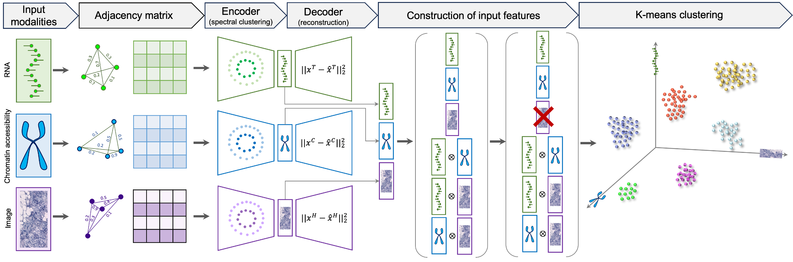

# Resolving tissue complexity by multi-modal spatial omics modeling with MISO

### Kyle Coleman*, Daiwei Zhang, Amelia Schroeder, Melanie Braisted, Niklas Blank, Alexis Jazmyn, Hanying Yan, Yanxiang Deng, Elizabeth F. Furth, Edward B. Lee, Christoph A. Thaiss, Jian Hu*, Mingyao Li*

MISO is a deep-learning based method developed for the integration and clustering of multi-modal spatial omics data. MISO requires minimal hyperparameter tuning, and can be applied to any number of 
omic and imaging data modalities from any multi-modal spatial omics experiment. MISO has been evaluated on datasets from experiements including spatial transcriptomics (transcriptomics and histology), 
spatial epigenome-transcriptome co-profiling (chromatin accessibility, histone modification, and transcriptomics), spatial CITE-seq (transcriptomics, 
proteomics, and histology), and spatial transcriptomics and metabolomics (transcriptomics, metabolomics, and histology)




## MISO Installation

Typical install time is ~1 min.  
MISO has been tested on the following operating systems: 
- macOS: Ventura (13.5.1)
- Linux: CentOS (7) 


MISO installation requires python version 3.7. The version of python can be checked by: 
```python
import platform
platform.python_version()
```

    '3.7.12'


We recommend creating and activating a new conda environment when installing the MISO package. For instance, 
```bash
conda create -n miso python=3.7.12
conda activate miso
```        

The MISO repository can be downloaded using:

```bash
git clone https://github.com/kpcoleman/miso
```

The MISO package and dependencies can then be installed:

```bash
python -m pip install -r requirements.txt
python setup.py install
```

Typical training time for MISO is ~1 min on a GPU and ~10 min on a CPU.  
For a tutorial, please see: https://github.com/kpcoleman/miso/blob/main/tutorial/tutorial.ipynb


## Software Requirements  
einops==0.6.0 
importlib 
importlib-metadata 
numpy==1.21.6 
opencv_python==4.6.0.66 
Pillow>=6.1.0 
scanpy==1.9.1 
scikit_image==0.19.3 
scikit_learn==1.0.2 
scipy==1.7.3 
setuptools==65.6.3 
torch==1.13.1 
torchvision==0.14.1 
tqdm==4.64.1 

H&E image feature extraction code is based on HIPT and iSTAR. Pre-trained vision transformer models are from HIPT.

